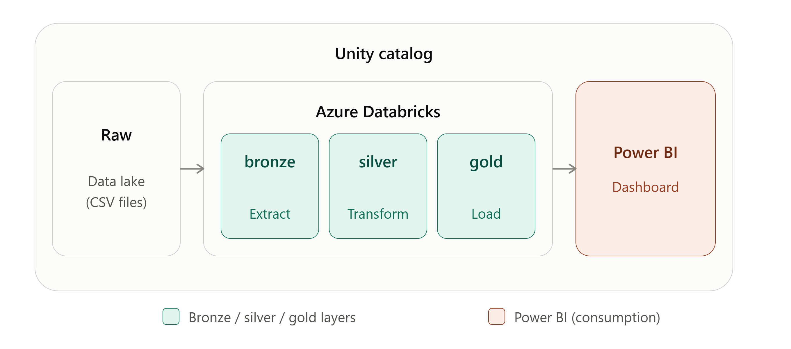
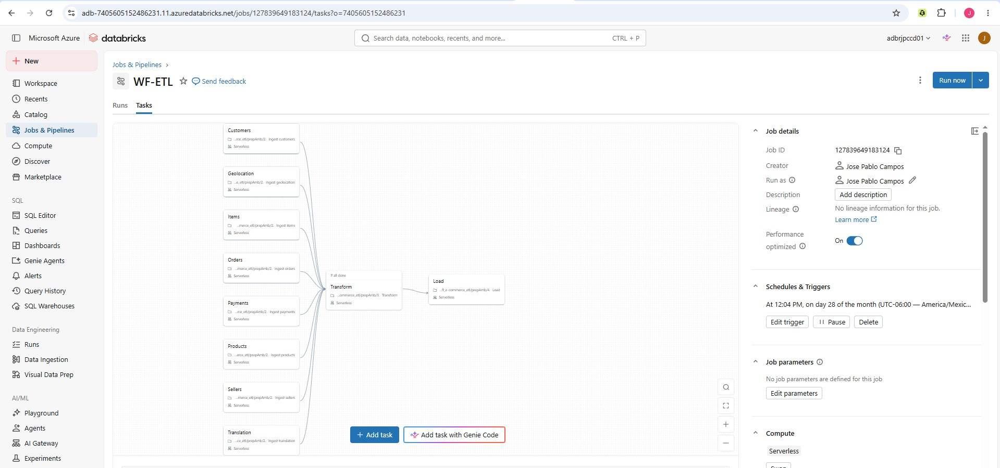
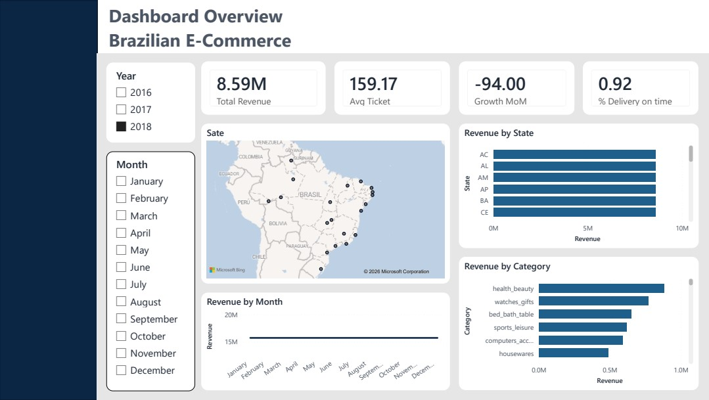

# E-COMMERCE SALES ETL & ANALYTICS PIPELINE
 
Medallion Architecture on Azure Databricks
 
Automated data pipeline for e-commerce sales, delivery performance, and geographic revenue concentration analysis, built with a three-layer (Bronze-Silver-Gold) architecture on Databricks and consumed through a Power BI executive dashboard.
 
## 🎯 Overview
 
ETL pipeline that ingests raw e-commerce order data (orders, items, payments, customers, products, sellers, geolocation, and category translation) and transforms it through the Medallion Architecture (Bronze → Silver → Gold) on Azure Databricks with Unity Catalog and Delta Lake, guaranteeing ACID consistency across every layer.
 
## ✨ Key Features
 
* 🔄 **Automated ETL** — end-to-end pipeline orchestrated as a Databricks Workflow
* 🏗️ **Medallion Architecture** — clear separation of Bronze → Silver → Gold layers
* 🧾 **Unified Order Grain** — Silver layer resolves multi-row payments and duplicate geolocation records into a single clean, order-item-level fact table
* 📊 **Business-Ready Gold Layer** — monthly sales trend, delivery performance, and geographic revenue concentration
* 📈 **Power BI Executive Dashboard** — single-page summary connected directly to a Databricks SQL Warehouse
* ⚡ **Delta Lake** — ACID transactions and time travel on every layer
* 🔒 **Unity Catalog** — governed catalog/schema structure with external locations per medallion layer
## 🏛️ Architecture
 
### Data Flow
 
```
📄 CSV (Raw Data in ADLS)
    ↓
🥉 Bronze Layer (raw ingestion, one table per source file)
    ↓
🥈 Silver Layer (joins, deduplication, payment & geolocation resolution)
    ↓
🥇 Gold Layer (business aggregations)
    ↓
📊 Power BI Dashboard
```
 


### Catalog / Schema Structure (Unity Catalog)
 
```
catalog_au
├── bronze
│   ├── customers
│   ├── geolocation
│   ├── items
│   ├── payments
│   ├── orders
│   ├── products
│   ├── sellers
│   └── translation
├── silver
│   └── orders_transformed        
└── gold
    ├── gold_sales_monthly        
    ├── gold_delivery_performance 
    └── gold_geo_concentration    
```
 
## 🚀 Setup
 
### 1️⃣ Clone the Repository
 
```bash
git clone <https://github.com/jpcampos04/2609_e-commerce_etl.git>
cd <2609_e-commerce_etl>
```
 
### 2️⃣ Configure Databricks Access
 
1. Go to your Databricks Workspace
2. **User Settings** → **Developer** → **Access Tokens**
3. Click **Generate New Token**
4. Copy and store the token securely
### 3️⃣ Configure External Locations (Unity Catalog)
 
Each medallion layer maps to its own container in ADLS. Confirm (or create) an external location per container before running the pipeline:
 
```sql
CREATE EXTERNAL LOCATION IF NOT EXISTS bronze_ext
URL 'abfss://raw@<storageAccount>.dfs.core.windows.net/'
WITH (STORAGE CREDENTIAL <credential_name>);
 
CREATE EXTERNAL LOCATION IF NOT EXISTS silver_ext
URL 'abfss://silver@<storageAccount>.dfs.core.windows.net/'
WITH (STORAGE CREDENTIAL <credential_name>);
 
CREATE EXTERNAL LOCATION IF NOT EXISTS gold_ext
URL 'abfss://gold@<storageAccount>.dfs.core.windows.net/'
WITH (STORAGE CREDENTIAL <credential_name>);
```
 
### 4️⃣ Storage Configuration
 
```python
storage_path = "abfss://raw@<storageAccount>.dfs.core.windows.net"
```
 
✅ **Setup complete!**
 
---
 
## 💻 Usage
 
### 🔧 Manual Execution in Databricks
 
Navigate to `/Workspace/Users/<your-user>/<project-folder>/proceso` and run in order:
 
```
- 1.- Ingest customers      → Bronze Layer
- 1.- Ingest geolocation    → Bronze Layer
- 1.- Ingest items          → Bronze Layer
- 1.- Ingest orders         → Bronze Layer
- 1.- Ingest payments       → Bronze Layer
- 1.- Ingest products       → Bronze Layer
- 1.- Ingest sellers        → Bronze Layer
- 1.- Ingest translation    → Bronze Layer
- 2.- Transform             → Silver Layer (orders_transformed)
- 3.- Load                  → Gold Layer (3 business tables)
```
 
### 🔄 Orchestrated Execution (Databricks Workflow)
 
The pipeline is deployed as a single Databricks Workflow (`WF-ETL`) via a Databricks Asset Bundle. All eight ingestion tasks run in parallel; `Transform` waits for **all** of them to succeed (`ALL_SUCCESS`) before building the Silver table, and `Load` runs last to build the three Gold tables.
 
```bash
databricks bundle deploy
databricks bundle run WF_ETL
```
 
---
 
## 🔄 Workflow
 
```yaml
Workflow: WF-ETL
├── Ingest Customers, Geolocation, Items, Orders,
│   Payments, Products, Sellers, Translation   (Bronze, parallel)
├── Transform                                  (Silver, runs only if all ingestions succeed)
└── Load                                       (Gold: sales, delivery, geo concentration)
```
 


⏰ **Schedule**: configurable via cron (currently monthly, adjustable to daily)
🌎 **Timezone**: America/Mexico_City
 
---
 
## 📈 Dashboard
 
The Gold layer feeds a single-page **Power BI** executive dashboard, connected directly to a Databricks SQL Warehouse (Import mode):
 
* **KPIs**: Total Revenue, Average Order Value, Month-over-Month Growth, On-Time Delivery %
* **Sales Trend**: monthly revenue by category
* **Delivery Performance**: % on-time and average delay by category/state
* **Geographic Concentration**: revenue by state on a map, plus a national HHI concentration index


https://github.com/jpcampos04/2609_e-commerce_etl/dashboard

## 🔍 Monitoring
 
**In Databricks:**
- Go to **Workflows** in the sidebar
- Find `WF-ETL`
- Review run history and per-task logs (stdout/stderr) for troubleshooting
---
 
## 👤 Author
 
**José Pablo Campos**
  
[](mailto:jpablocampos04@gmail.com)
 
---
 
## 📄 License
 
This project is licensed under the MIT License — see the [LICENSE](LICENSE) file for details.
 
---
 
**Project**: Data Engineering — Medallion Architecture
**Tech Stack**: Azure Databricks · Unity Catalog · Delta Lake · Power BI